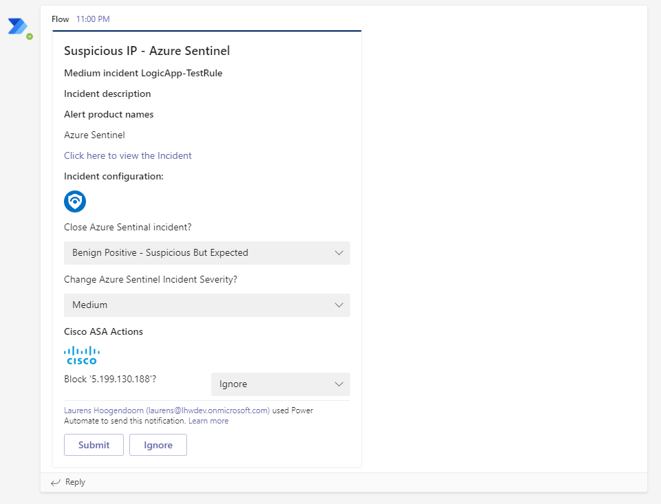
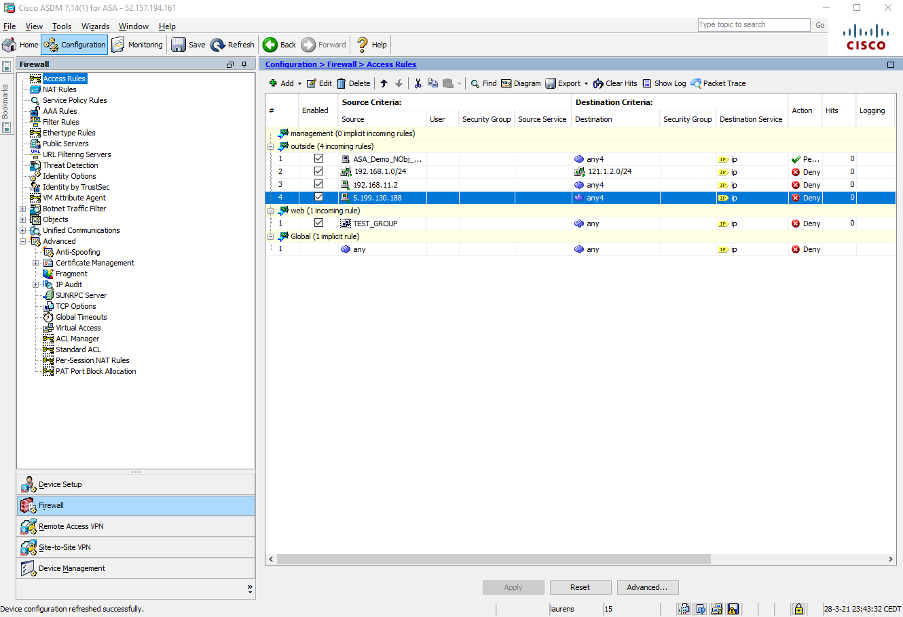
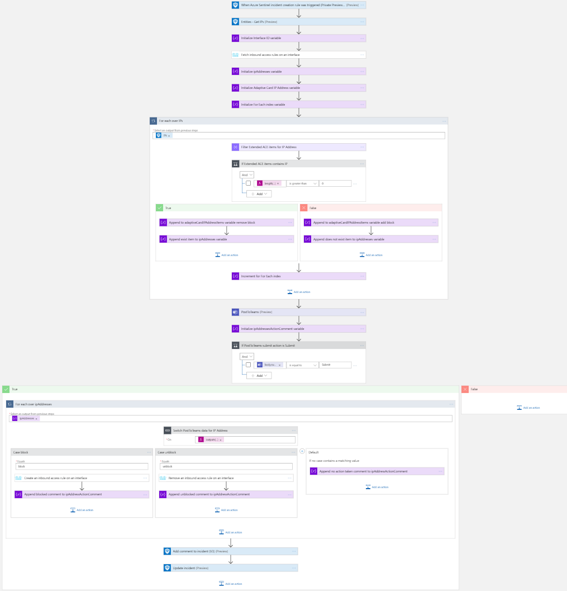

# Cisco ASA - Create or remove access rules on an interface for IP Addresses

## Summary

This playbook allows blocking/unblocking of IPs in Cisco ASA, using **Access Rules** which will be created on an interface.

When a new Sentinel incident is created, this playbook gets triggered and performs below actions
1. For the IPs we check if they are already directly blocked by an access rule on the interface
2. An adaptive card is sent to a Teams channel with information about the incident and giving the option to ignore an IP, or depdening on it's current status block it by adding an access rule or unblock it by removing an access rule
    
3. Comment is added to Azure Sentinel incident.

**Inbound access rule is added in Cisco ASA:**

**Playbook overview:**

### Prerequisites
1. **This playbook template is based on Azure Sentinel Incident Trigger which is currently in Private Preview (Automation Rules).** You can change the trigger to the Sentinel Alert trigger in cases you are not part of the Private Preview.
2. Cisco ASA custom connector needs to be deployed prior to the deployment of this playbook, in the same resource group and region. Relevant instructions can be found in the connector doc page.
3. Cisco ASA needs to have an interface configured. When enabling the interface you have to give it a name, since that is used by the API calls. To use Cisco ASDM to edit an interface, see [Enable the Physical Interface and Configure Ethernet Parameters](https://www.cisco.com/c/en/us/td/docs/security/asa/asa96/asdm76/general/asdm-76-general-config/interface-basic.html#ariaid-title14)

### Deployment instructions 
1. Deploy the playbook by clicking on "Depoly to Azure" button. This will take you to deplyoing an ARM Template wizard.

2. Fill in the required paramteres:
    * Playbook Name: Enter the playbook name here (ex:CiscoASA-CreateInboundAccessRuleOnInterface)
    * Cisco ASA Connector name : Enter the name of the Cisco ASA custom connector (default value:CiscoASAConnector)
    * Interface ID : The name of the interface you want to create the access rules on.

### Post-Deployment instructions 
#### a. Authorize connections
Once deployment is complete, you will need to authorize each connection.
1.	Click the Azure Sentinel connection resource
2.	Click edit API connection
3.	Click Authorize
4.	Sign in
5.	Click Save
6.	Repeat steps for other connections such as Teams and Cisco ASA (For authorizing the Cisco ASA API connection, the username and password needs to be provided)

#### b. Select Teams channel
The Teams channel to which the adaptive card will be posted will need to be configured.
1. Click the Azure Logic app resource
2. Edit the Logic App
3. Find the 'PostToTeams' action
4. Select a Team and Channel
5. Save the Logic App

#### c. Configurations in Sentinel
1. In Azure sentinel analytical rules should be configured to trigger an incident with IP Entity.
2. Configure the automation rules to trigger this playbook
