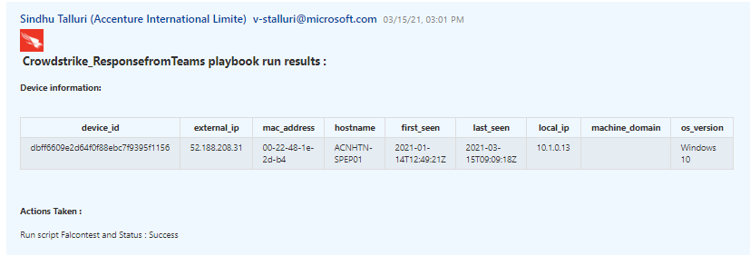
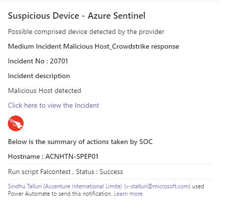
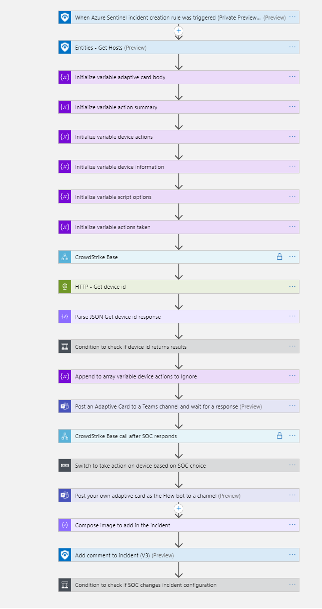

# Crowdstrike-ResponsefromTeams playbook
 ## Summary
 When a new Azure Sentinel incident is created, this playbook gets triggered and performs below actions:
 1. Fetches the device information from Crowdstrike
 1. Contain the device or run a script based on SOC action
 1. Add a comment to the incident with the information collected from the Crowdstrike, summary of the actions taken and close the incident
    

**Adaptive card that will be sent in the Teams SOC Channel:**

**Summary card that will be sent in the Teams SOC Channel to indicate actions success:**

**Playbook overview:**

### Prerequisites 

1. Azure Key vault is required for storing the Crowdstrike ClientID and Secrets, create key vault if not exists [learn how](https://portal.azure.com/#create/Microsoft.Template/uri/https%3A%2F%2Fraw.githubusercontent.com%2FAzure%2Fazure-quickstart-templates%2Fmaster%2F201-key-vault-secret-create%2Fazuredeploy.json)
2. Add Crowdstrike Client ID and Client Secret in Key vault secrets and capture the keys which are required during the template deployment
3. The base playbook should be added in the access policies of Key vault [learn how](https://docs.microsoft.com/azure/key-vault/general/assign-access-policy-portal)
4. There should be a list of prewritten scripts in Crowdstrike.[learn how](https://falcon.crowdstrike.com/support/documentation/71/real-time-response-and-network-containment#rtr_custom_scripts) our playbook does not provide an option to create a script.
5. To run a script user needs to be an RTR Active Responder and RTR Administrator in the falcon console.[Understand and assign Real Time Responder roles](https://falcon.crowdstrike.com/support/documentation/71/real-time-response-and-network-containment#rtr_roles)
6. The following needs to be done on the host to run a script:
   *  Configure [Response Policies](https://falcon.crowdstrike.com/support/documentation/71/real-time-response-and-network-containment#rtr-policy-config) - create policies and assign host groups to them
   * 	Enable the toggle real time functionality and enable custom scripts toggle to run them in [Real time resonse policy settings](https://falcon.crowdstrike.com/support/documentation/71/real-time-response-and-network-containment#rtr-policy-config)

### Deployment instructions 
1. Deploy the playbook by clicking on "Deploy to Azure" button. This will take you to deploying an ARM Template wizard.
  
   

2. Fill in the required parameters:
    * Playbook_Name: Enter the playbook name here (Ex:Crowdstrike_ContainHost)
    * CrowdStrike_Base_Playbook_Name : Enter the base playbook name here (Ex:CrowdStrike_Base)
    * Teams GroupId : Enter the Teams GroupId
    * Teams ChannelId : Enter the Teams ChannelId
      [Refer the below link to get the channel id and group id](https://docs.microsoft.com/powershell/module/teams/get-teamchannel?view=teams-ps)
    
### Post-Deployment instructions 
#### a. Authorize connections
Once deployment is complete, you will need to authorize each connection.
1.	Click the Azure Sentinel connection resource
2.	Click edit API connection
3.	Click Authorize
4.	Sign in
5.	Click Save
6.	Repeat steps for Teams connection as well
#### b. Configurations in Sentinel
1. In Azure sentinel analytical rules should be configured to trigger an incident with risky device 
2. Configure the automation rules to trigger this playbook

## Playbook steps explained

### When Azure Sentinel incident creation rule is triggered
Azure Sentinel incident is created. The playbook receives the incident as the input.

### Entities - Get Hosts
Get the list of risky devices as entities from the Incident

### Initialize the below variables
  a. Adaptivecardbody - Assing the dynamically prepared adaptive card body

  b. ActionSummary - Assign the summary of the actions taken by SOC
  
  C. DeviceActions - Choice list contains actions information [ Contain/LiftContainment, RunScript and Ignore ]

  b. DeviceInfo - Assign the Crowdstrike device information

  d. Scriptoptions - Assign the list of script names present in crowdstrike to display in the choice list of adaptive card

  e. ActionTaken - Assign the action taken on host by SOC on device
  

### CrowdStrike Base
Call the base logic App to get access token and Falcon Host URL

### HTTP - Get device id
This gets the device id from crowdstrike by filtering on hostname

### Parse JSON Get device id response
This prepares Json message for the device id response

 ### Condition to check if device is present in crowdstrike
1. If device is present, get the device information from crowdstrike API and prepares HTML table with required information
2. Check if the device status or assigned to predefined policy or contains any predefined scripts 
3. Prepare choice lists based on the response returned by API [ Contain/Lift Containment, Run Script and Ignore ]

 ### Compose Adaptive card
This action will compose the dynamically collected devices info [device actions] and choice list

### Post an adaptive card and wait for the SOC action
This action will send an adaptive card to the SOC with the dynamically collected information

### CrowdStrike Base
Again Call the base logic App to get access token and Falcon Host URL

### Switch to take action on the device
This action make a call to the CrowdStrike cloud API endpoint to take the necessary actions based on SOC [ Contain/LiftContainment/Run Script and Ignore ]

### Post a summarized adaptive card 
This action will send an adaptive card with the summary of actions taken

 ### Compose image to add in the incident
This action will compose the Crowdstrike image to add to the incident comments

### Add a comment to the incident with the information
This action will enrich the incident with the constructed HTML table with device information and action taken

### Close the Incident
This action will close the incident if there are no exceptions occurred while acting on the devices
