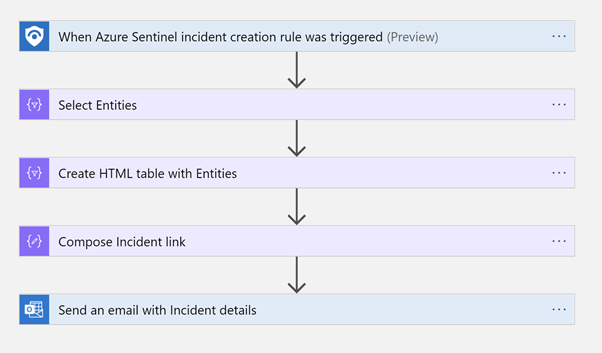
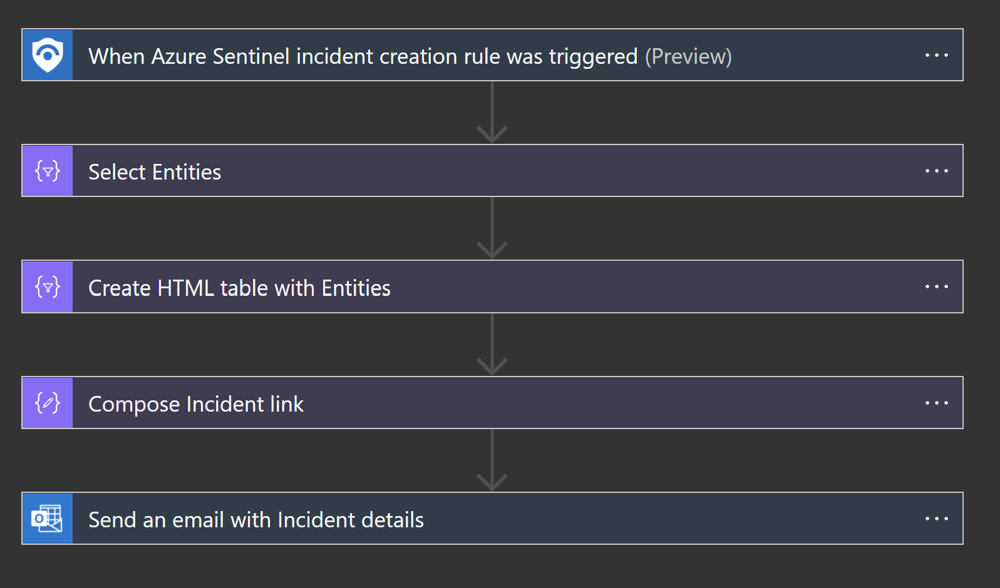
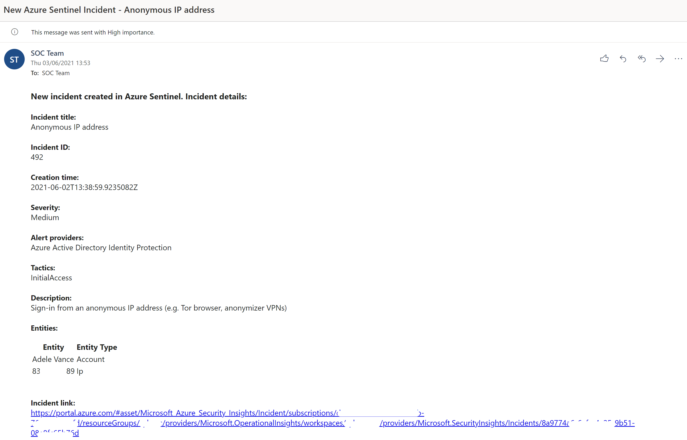
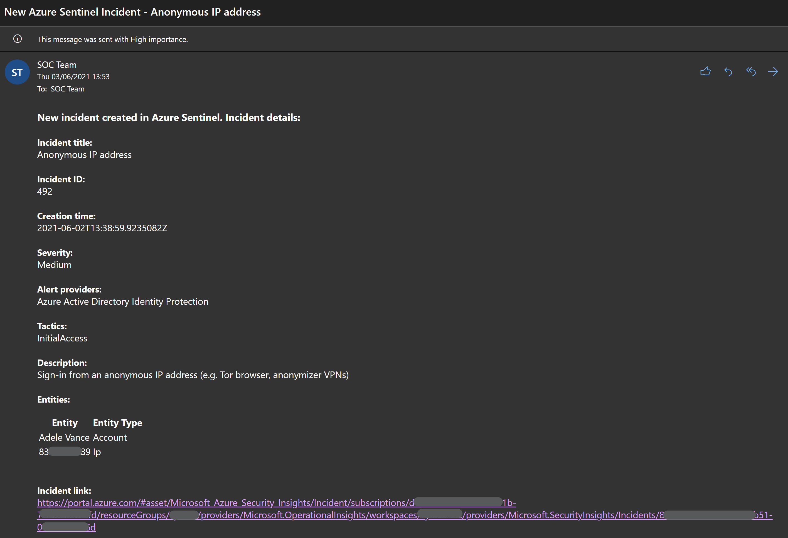

# Send-basic-email
author: Benjamin Kovacevic

This playbook will be sending email with basic incidents details (Incident title, severity, tactics, link,…) when incident is created in Azure Sentinel.
  
## Pre-requisites:
An O365 account to be used to send email notification 
(The user account will be used in O365 connector (Send an email).)
  
## Deployment:

## Post-deployment

### Configure connections
Edit the Logic App or go to Logic app designer. 
Expand “Send an email with Incident details” and fix this connector by adding a new connection or signing-in to marked one with user that has mailbox. 
Note:  Email sent with this playbook will be from user that creates connection!  

### Attach the playbook
After deployment, attach this playbook to an automation rule so it runs when the incident is created.
[Learn more about automation rules](https://docs.microsoft.com/azure/sentinel/automate-incident-handling-with-automation-rules#creating-and-managing-automation-rules) 
Note: Playbook is disabled by default. Please enable it before assigning to the Automation rule!
  
## Screenshot
### Playbook screenshoot

### Email screenshot

